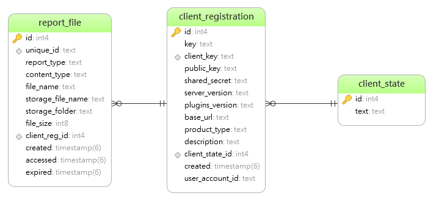

# Aspose.PDF Exporter development

## Jira cloud infrastructure
In order to develop application for Jira Marketplace developer have to integrate its application into Jira cloud instance, thus local application instance should be accessible from outside by https. Easiest solution is to run https tunnel (see [Pagekite](pagekite-tunnel) section). 

### Description

Aspose.PDF Exporter defines two widgets (see **webItems** section in *template/app-descriptor-template.Mustache*), one to export single issue, another is to export multiple issues at once. All requests to these widgets are handled by **Pages/ExporterContentPane** Razor page. Actual report generation is performed by **JiraExporterController** 
After report generation is finished user can download or share link to the report without any restrictions. Report file will be available within **24h**.

All Jira Cloud authentication tasks are performed in _JiraAuthMiddleware_ middleware that checks JWT token, performs validation and assigns registration data to the _RegistrationData_ scoped service parameter 

### Pagekite tunnel 

* Https tunnel allows you to access your local development http server from outside the world using https. 

* Register at https://pagekite.net/ 

* run
  ``` 
  c:\python27\python pagekite.py --debugio 62683 jirappdemo.pagekite.me +rewritehost=localhost
  ```
  Where **62683** - local port, **jirappdemo.pagekite.me** - persistent URl
  
* At the end your local development instance should be visible by https://jirappdemo.pagekite.me

* Now you can set **Settings:BaseAppUrl** variable to **jirappdemo.pagekite.me** so your Jira cloud instance can use it.

  

### Migrations

* Initial migration

  ```
  Add-Migration InitialCreate
  ```

* add migration

  ```
  Add-Migration MigrationIdentifier
  ```

* Remove last migration

  ```
  Remove-Migration
  ```

* Update database to specific MigrationIdentifier

  ```
  Update-Database MigrationIdentifier
  ```

* 11


### Database Entities



Where
* **client_registration** stores registration data for specific client. 
* **client_state** stores client states (predefined values) 
* **report_file** stores information about generated reports

  